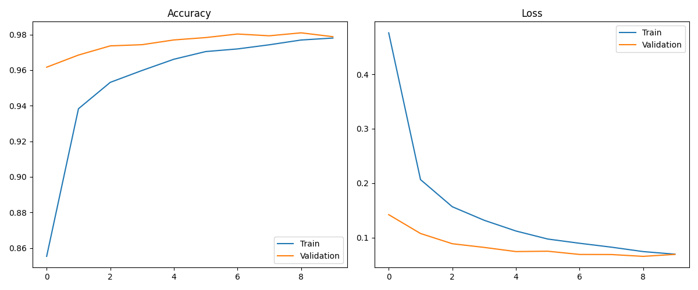
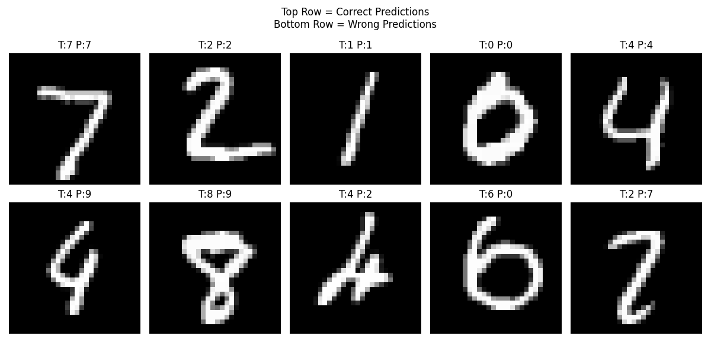

# MNIST Digit Classifier

A deep learning project built using TensorFlow/Keras to classify handwritten digits (0–9) from the MNIST dataset.

## Results

- Test Accuracy: ~98%
- Training Images: 60,000
- Test Images: 10,000

## Technologies

- Python
- TensorFlow
- Keras
- NumPy
- Matplotlib

## Training History



## Sample Predictions



## Run Locally

```bash
pip install -r requirements.txt
python train.py
